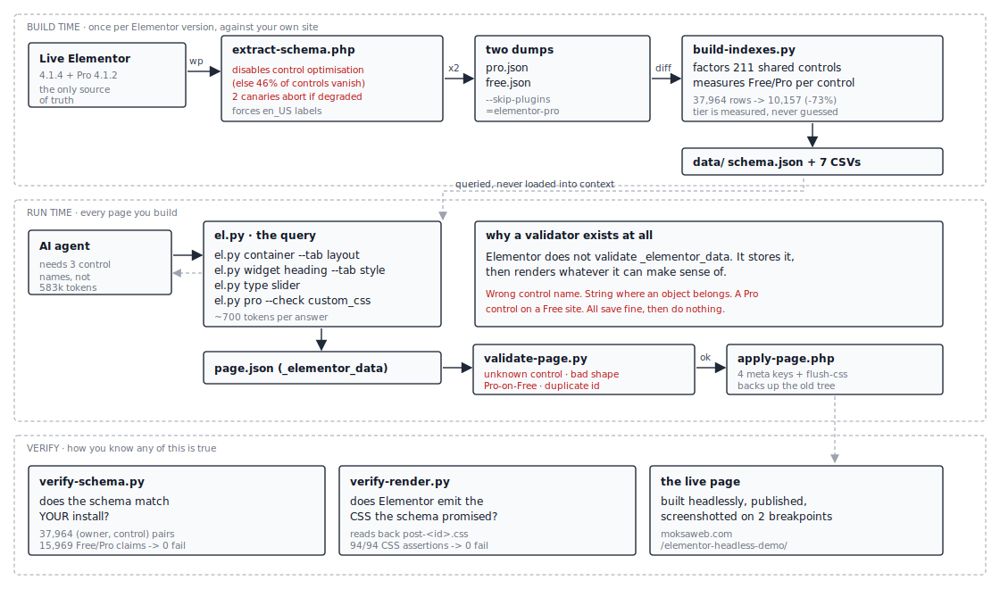

# elementor-headless

**Build Elementor pages by writing the JSON, not by driving the editor.**

An [Agent Skill](https://platform.claude.com/docs/en/agents-and-tools/agent-skills/overview)
that gives an AI coding agent the complete Elementor authoring surface —
**37,964 controls across 135 widgets and 3 elements** — as a queryable database
instead of a 583,555-token document it can never afford to read.

English · [繁體中文](README.zh-TW.md) · [日本語](README.ja.md) · [한국어](README.ko.md)

---

## Why

Elementor stores a page as a JSON tree in post meta. Write the tree and the page
exists. But Elementor **does not validate what you write** — it stores your value,
renders what it understands, and silently drops the rest.

There is no error. A misspelled control, a string where an object belongs, a
Pro-only control on a Free site: all of them save cleanly, render fine on your
machine, and quietly do nothing where it matters.

So an agent building Elementor pages has two options: read Elementor's PHP source
every time (expensive — and it still doesn't tell you the JSON shape), or guess
(silently wrong). This skill is the third one.

```bash
$ python tools/el.py type slider
control type: slider   [FREE]  (elementor-core)

JSON value shape (what you write into _elementor_data settings):
  {"unit": "px", "size": "", "sizes": []}
```

## How it works



Three phases. Extraction runs once per Elementor version, against **your** site.
Everything after that is a query.

## Install

```bash
git clone https://github.com/Moksa1123/elementor-headless
cd elementor-headless
python tools/install-skill.py claude-code --global     # or: cursor, codex-cli, gemini-cli, ...
python tools/install-skill.py --list
```

8 platforms: Claude Code, Claude.ai, Cursor, Codex CLI, Gemini CLI, Devin
(ex-Windsurf), GitHub Copilot, Continue. Conventions re-verified 2026-07-11 —
[3 of the 8 had drifted in six weeks](references/multiplatform-install-verification.md),
so they are checked, not assumed.

## Use

```bash
python tools/el.py widgets --tier free --grep box   # find a widget
python tools/el.py widget heading --tab style       # its style controls
python tools/el.py container --tab layout           # flex + grid, with conditions
python tools/el.py css border-radius                # reverse lookup by CSS property
python tools/el.py group typography                 # what a group control expands into
python tools/el.py breakpoints                      # the responsive suffixes
python tools/el.py pro --check custom_css align     # exits 1 if any of these needs Pro
```

Then build, check, ship:

```bash
python tools/el.py skeleton > page.json
python tools/validate-page.py page.json --target free
wp eval-file tools/apply-page.php 123 page.json
```

`validate-page.py` catches what Elementor won't: unknown control names, wrong value
shapes, illegal units, invalid options, duplicate ids, unmet conditions, and
Pro-only controls on a Free target.

## Token cost

**89.1% fewer tokens than reading Elementor's source. 99.1% fewer than loading the
schema.** Reproduce it — the script writes `data/token-benchmark.csv`:

```bash
pip install tiktoken
python tools/benchmark-tokens.py --elementor-src /path/to/plugins/elementor
```

| Task | read source | load schema | **query** |
|---|---|---|---|
| Lay out a hero container (flex, boxed, responsive padding) | 20,182 | 583,555 | **964** |
| Style a heading (colour, typography, alignment) | 8,329 | 583,555 | **730** |
| Style a button (colour, padding, radius, hover) | 7,803 | 583,555 | **2,935** |
| Make any widget's spacing responsive | 11,800 | 583,555 | **243** |
| Find which control drives a CSS property | — | 583,555 | **363** |
| **Total** | **48,114** | **583,555** | **5,235** |

Two things make it work: the data is **queried, never loaded**, and the 211
Advanced-tab controls that every widget shares are **stored once instead of 135
times** — they are 75.6% of all rows, so factoring them out shrinks the schema by
73.2%.

Measured with tiktoken `cl100k_base` — OpenAI's tokenizer, not Claude's, so
absolute counts shift by roughly ±10%. Ratios between two texts under the same
tokenizer are stable, and the ratio is the claim. Method and caveats:
[token-efficiency.md](references/token-efficiency.md).

## Free vs Pro is measured, not guessed

Elementor Pro **injects controls into free widgets**. Open the free Heading widget
on a site with Pro and you'll find Motion Effects, Sticky, Custom CSS, Display
Conditions and Custom Attributes sitting in its Advanced tab. Inherit the widget's
tier and every one of them gets labelled "free" — and the page you build renders
perfectly for you, then loses its styling on a Free install.

So the tier is measured. Extract twice — once with Pro loaded, once with
`wp --skip-plugins=elementor-pro` (which affects only that one CLI process; nothing
is deactivated, so it is safe on production) — and diff:

| | Free 4.1.4 | + Pro 4.1.2 |
|---|---|---|
| widgets | 64 | **135** |
| controls on every widget | 165 | **211** (+46) |
| controls on `container` | 277 | **356** (+79) |
| control types | 52 | **59** |
| group controls | 11 | **16** |

The 46 that Pro injects into **every** widget: all `motion_fx_*` (37), `sticky*`
(6), `custom_css`, `_attributes`, `e_display_conditions`.

Do not reason about tiers. **Border and Box Shadow look premium and are free.
`_attributes` looks basic and is Pro.** This repo shipped Border mislabelled as Pro
once, by reasoning instead of measuring.

## Is it accurate? Make it prove it.

The schema came from Elementor 4.1.4 / Pro 4.1.2. Yours may differ. Don't trust it
— test it. Two verifiers, two different questions.

**1. Does the schema match your install?**

```bash
wp eval-file tools/extract-elementor-schema.php core+pro > mine.json
wp --skip-plugins=elementor-pro eval-file tools/extract-elementor-schema.php core+pro > mine-free.json
python tools/verify-schema.py mine.json --free-dump mine-free.json
```

```
checked 37,964 (owner, control) pairs from the shipped schema
Free/Pro claims checked on free widgets/elements: 15,969
FAILURES: 0
PASS
```

Exits non-zero on drift, so it can gate a deploy.

**2. Does a page built from the schema render the CSS the schema promised?**

The schema says which CSS properties each control drives. This builds the page for
real, reads back the stylesheet Elementor compiled, and checks every one — including
that each responsive key landed inside *that breakpoint's* media query.

```bash
python tools/verify-render.py examples/demo-page.json rendered.css --post-id 9176
```

```
CSS property assertions: 94/94 passed
PASS
```

**3. Look at it.** `examples/demo-page.json` is a real published page, built with
nothing but this skill. The Elementor editor has never been opened on it.

**https://moksaweb.com/elementor-headless-demo/**

## What's in the box

```
data/
  elementor-schema.json    2.7 MB   the full surface - queried, never loaded
  controls.csv             2.0 MB   every widget/element-specific control
  common-controls.csv       39 KB   the 211 shared by every widget
  pro-only-controls.csv     33 KB   the safety table
  pro-only-widgets.csv     3.0 KB
  control-types.csv        4.6 KB   all 59 JSON value shapes
  group-controls.csv       3.7 KB   16 groups, and the flat keys they expand to
  widgets.csv              8.2 KB   135 widgets + 3 elements
  breakpoints.csv          0.2 KB
  token-benchmark.csv               reproducible measurements

tools/
  el.py                          query the schema - the front door
  validate-page.py               pre-flight a page tree
  apply-page.php                 write it: meta + CSS rebuild + backup
  extract-elementor-schema.php   dump a live install
  build-indexes.py               dump -> shipped data files
  verify-schema.py               does the schema match your install?
  verify-render.py               does Elementor emit what the schema promised?
  benchmark-tokens.py            reproduce the token numbers
  install-skill.py               8-platform installer

references/   data-model · control-types · containers-and-layout · responsive
              templates-and-conditions · extraction-traps · token-efficiency
examples/     demo-page.json - the published page above
```

## The three traps

The naive way to extract this data is wrong in three separate ways, each producing
a schema that looks complete and lies. All three were shipped in this repo before
being caught. Write-ups in [extraction-traps.md](references/extraction-traps.md):

1. **WP-CLI looks like the front end to Elementor**, so it hands back the lean
   control stack: **46% of controls and ~100% of tab/label metadata vanish**, with
   no error. The extractor disables that path, and has two canaries that abort
   rather than emit degraded data.
2. **Responsive is two mechanisms**, and the obvious test finds only one. There is
   no `padding_tablet` control object *anywhere* — and `padding_tablet` works.
   Detecting responsive by looking for suffixed siblings missed padding, margin,
   width, font size and gap. (9.8% → 30.1% of controls after the fix.)
3. **A control's tier is not its widget's tier**, because Pro injects into free
   widgets. Measured, not inherited.

## Contributing

Re-extract against a newer Elementor and open a PR with the regenerated `data/` —
`verify-schema.py` will tell you exactly what changed. See
[CONTRIBUTING.md](CONTRIBUTING.md).

## License

MIT. Built and maintained by **moksa** · [moksaweb.com](https://moksaweb.com)

Sibling skill: [rankmath-seo-wp](https://github.com/moksa1123/rankmath-seo-wp)
